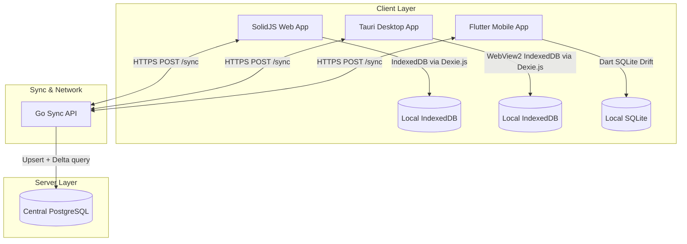
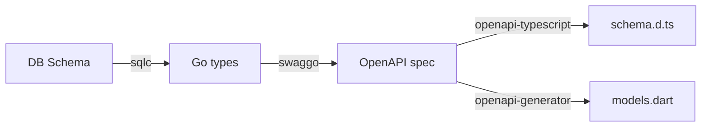
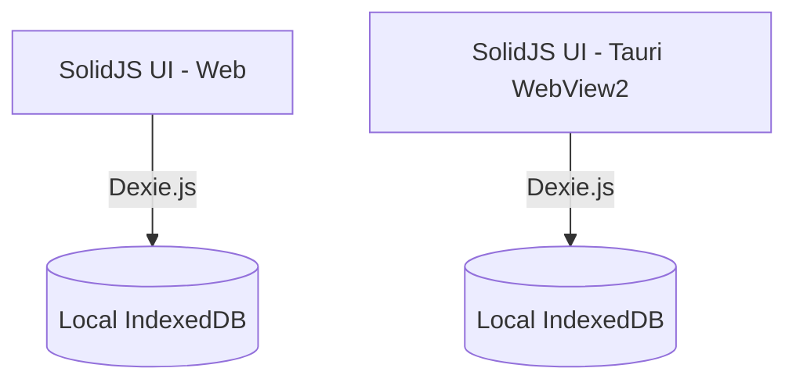
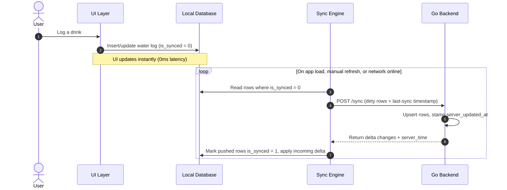
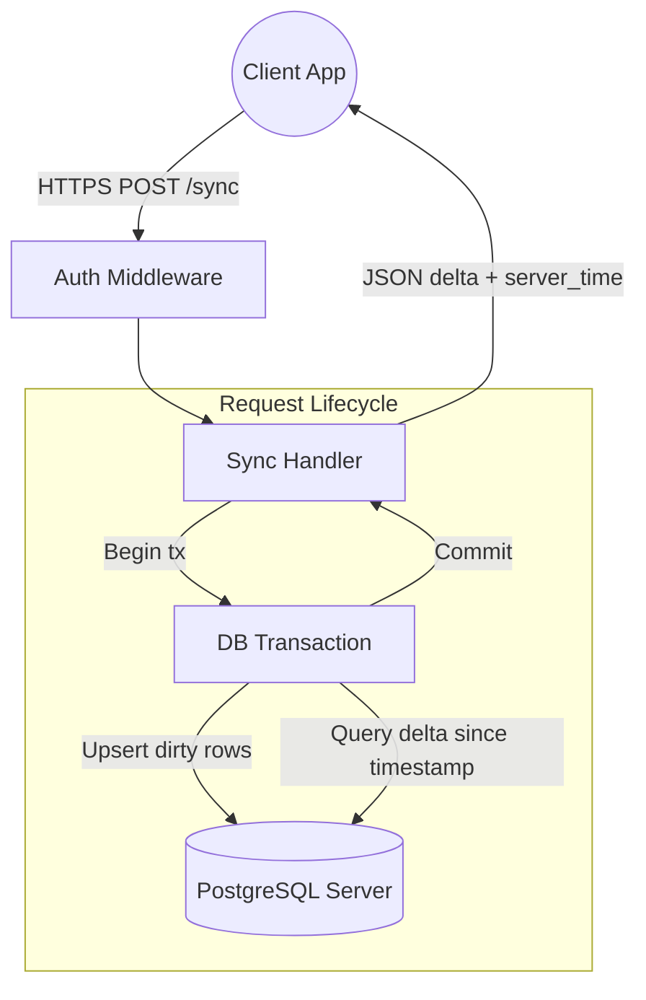
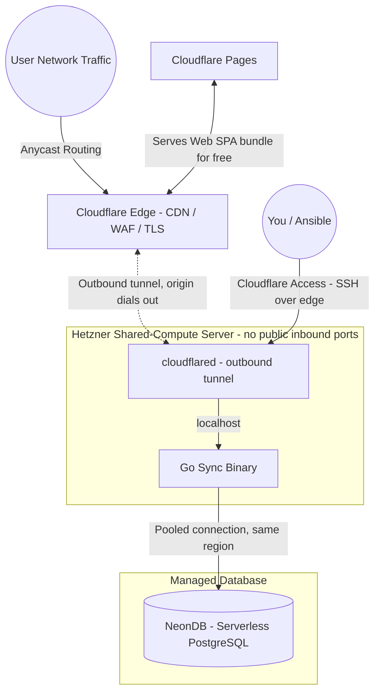
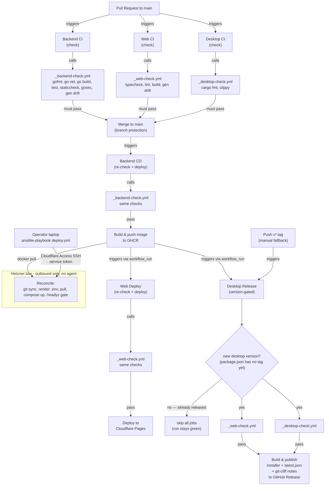
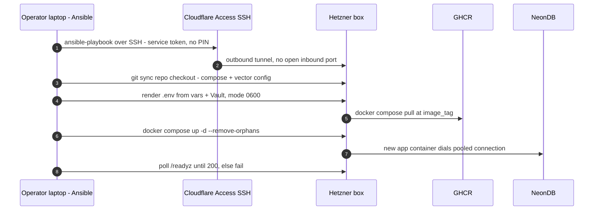
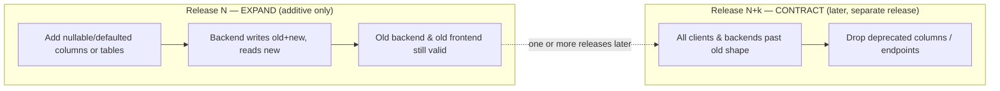
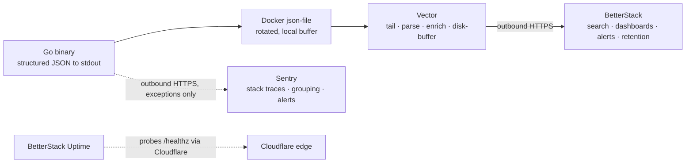

# Drinkwater: Local-First Hydration Tracker Architecture Specification

This document details the architecture for Drinkwater, a cross-platform, local-first hydration tracking application across Web, Desktop (Windows/macOS), and Mobile (Android/iOS). It is optimized for low operating cost, running a stateless Go backend on lightweight, disposable compute behind the Cloudflare edge.

---

## 1. System Topology & Data Flow

The application utilizes a **local-first paradigm**. The client-side database serves UI reads locally, guaranteeing zero-latency interactions for the user. The local store is intentionally **ephemeral**: it holds only the current day's logs, and non-today data is pruned on every sync attempt to keep client storage extremely light. On sync, the central Go backend is the **write authority**: it owns the canonical server-side record, stamps each upsert with its own `server_updated_at` timestamp, resolves conflicts so that server data is the source of truth, and serves as the durable archive of all history in PostgreSQL.



---

## 2. Repository & Schema Single Source of Truth

To manage three platforms without structural friction, the project uses a single **GitHub Monorepo**. Data structures are defined once via the database schema, exposed as an **OpenAPI** specification, and compiled into TypeScript, Dart, and Go.

### Monorepo Layout

```text
/drinkwater
├── /backend                 # Go Source Code (Sync server, API, Auth)
├── /web-desktop             # SolidJS Frontend (Shares code between Web and Desktop)
│   ├── /src                 # SolidJS UI components and state logic
│   └── /src-tauri           # Tauri shell configuration (Rust) that hosts the web build
├── /mobile                  # Flutter Application (Android/iOS)
└── /shared-schemas          # Core OpenAPI specifications for auto-generation

```

### Schema Generation Pipeline

When a data model changes, it begins in the database schema, which generates the Go types and, via swaggo, the OpenAPI specification in `/shared-schemas`. Code generation scripts then update all targets from that spec:



---

## 3. Client Storage

Web and Desktop share a single storage stack: **Dexie.js over IndexedDB**. The Tauri desktop app hosts the exact same SolidJS web build inside its WebView2 runtime, which provides IndexedDB natively, so the desktop client reuses the web data layer with no Rust storage code, no IPC hop, and no second database implementation to maintain.

The local store only ever holds the current day's logs (older rows are pruned on each sync, with PostgreSQL as the durable archive), so the dataset stays tiny and native SQLite on desktop is unnecessary.



### Database Matrix

- **Web (IndexedDB + Dexie.js):** Standard object store wrapper. Provides basic query capability within browser security sandboxes.
- **Desktop (Tauri WebView2 + IndexedDB + Dexie.js):** Runs the shared SolidJS web build; storage is the same Dexie/IndexedDB layer as Web.
- **Mobile (Flutter + Drift):** Drift provides a reactive, typesafe SQLite wrapper for Dart. It executes queries on a background isolate to keep the Flutter UI rendering smoothly.

---

## 4. Offline-First Sync & Conflict Resolution

The sync engine uses a **state-based** model with a local dirty flag to handle intermittent network availability. Each local record carries an `is_synced` flag; the engine pushes the full current state of dirty rows rather than a stream of mutation events.

### The Client Sync Cycle



### Conflict Resolution Strategy

Conflicts are resolved by **server-authoritative Last-Write-Wins**. Records are per-user and client-generated UUIDs keep rows from different devices distinct, so concurrent logging is a union rather than a conflict. When the same row is edited or deleted on more than one device, the backend's `server_updated_at` timestamp is the tiebreaker and the last write to reach the server wins.

---

## 5. Go Backend Architecture

The backend is a **stateless REST API** built on standard-library `net/http` paradigms paired with the `chi` router. Each sync is a single request/response cycle, so there are no long-lived connections, no connection hub, and no message broker to operate.



---

## 6. The Lean Deployment Strategy (Low-Cost, High-Performance)

The backend is a single stateless Go binary shipped with a minimal **Docker Compose** stack on an affordable **Hetzner shared-compute** server. Public ingress is handled by a **Cloudflare Tunnel** rather than a public reverse proxy, so the server has **no open inbound ports**. Durable state lives in a managed **NeonDB** (serverless PostgreSQL). The compute node stays lean, cheap, fully disposable, and invisible to the public internet; the history archive is run by a provider with managed backups and failover.

### Deployment Topography



### Infrastructure Components

1. **The Runtime:** A minimal **Docker Compose** stack (version-controlled in the repo) runs **`cloudflared`** (the Cloudflare Tunnel daemon) alongside the single Go `app` container and the `vector` log shipper. `cloudflared` makes an **outbound** connection to the Cloudflare edge and forwards public traffic down that tunnel to the app on `localhost`. TLS terminates at the edge, so there is no public reverse proxy, no Let's Encrypt certificate management, and no listening port. Deploys are **pushed from the operator's laptop with Ansible** over the same Cloudflare Access SSH path (see §7); nothing extra runs on the box between deploys, and CI does not connect to the server.
2. **The Hardware:** A **Hetzner shared-compute (CX/CPX) server**, starting around 5USD/month. Go is memory efficient and the backend is stateless, so a small shared instance handles the low-frequency, batched sync traffic, and can be destroyed and redeployed at will since it holds no durable data.
3. **Database Persistence:** **NeonDB**, a managed serverless PostgreSQL, is the durable archive of all history (the local client store is pruned to today-only). It is chosen for affordability and safety: it **scales to zero** so we pay for database compute only while a sync is actually running, and it provides managed backups, point-in-time recovery, and failover that we would otherwise have to operate ourselves. The trade-off — network latency and cold-start wake from autosuspend — is acceptable because sync is infrequent and batched (one `POST /sync` per refresh); it is mitigated by placing the Neon project in the **same region** as the Hetzner server and using Neon's **pooled connection** endpoint to respect serverless connection limits.
4. **Web Delivery:** The SolidJS web frontend (the SPA bundle) is deployed to **Cloudflare Pages**. This is completely free, globally distributed, and serves the static files at edge speeds, meaning the Hetzner server spends zero CPU cycles serving HTML/JS and dedicates 100% of its resources to processing sync requests.

### Security Posture

The deployment is designed so that **nothing connects to the origin server directly** — every byte of inbound traffic must pass through the Cloudflare edge first.

- **Zero public attack surface.** The Hetzner firewall denies all inbound traffic; the only network path into the box is the outbound tunnel that `cloudflared` itself dials out. There are no ports to scan and no service answering on the raw IP, so the origin IP is irrelevant even if it leaks (via DNS history, TLS transparency logs, or email headers).
- **Unbypassable edge controls.** Because the tunnel is the only way in, Cloudflare's WAF, rate limiting, and DDoS absorption cannot be bypassed by hitting the origin directly — the classic "WAF bypass via leaked origin IP" attack is structurally impossible.
- **Inbound flows through the edge only.** Public clients and third-party callers (e.g. **Stripe webhooks**) reach the API by calling the Cloudflare hostname; the edge accepts the request and forwards it down the tunnel to the Go binary. Webhook endpoints still verify their own authenticity (e.g. validating the `Stripe-Signature` header) and can be restricted to the provider's published IP ranges with a WAF rule.
- **Outbound is unrestricted.** The server initiates its own outbound connections — the pooled query to NeonDB and the tunnel to Cloudflare — unaffected by the closed inbound firewall.
- **Private admin access.** SSH is not exposed publicly. Administrative access is brokered through **Cloudflare Access** over the same edge (authenticated against our identity provider), so port 22 stays closed to the internet while remaining reachable to authorized operators.

---

## 7. Continuous Delivery & Release Management

Delivery is **push-based from the operator's laptop**, driven by **Ansible**. CI builds, verifies, and publishes an immutable image; a single `ansible-playbook` run then reconciles the box to that image. The box still has **no open inbound ports** (§6) and runs **no deploy agent** — Ansible reaches it over the **same Cloudflare Access SSH path** used for admin access (a Cloudflare Access **service token** lets it pass non-interactively), so the push rides the existing outbound tunnel rather than any reopened port. CI itself never connects to the server and holds no SSH keys or server credentials.

> **Design note (lean-infra):** an earlier design called for a pull-based on-box `systemd` deploy agent driving blue-green `app-blue`/`app-green` cutover behind a `:production` promotion gate. For a single low-traffic app that machinery costs more to operate than the ~1s brownout it removes, so it is **deferred** — the agentless Ansible flow below is what actually runs; the blue-green design remains the north star if traffic or app-count grows.

Three artifacts ship from one monorepo on independent timelines and must stay mutually compatible: the **DB schema** (NeonDB), the **backend image** (Hetzner), and the **frontend bundle** (Cloudflare Pages).

### Pipeline Overview

**Pull requests:** Three CI workflows (`ci-backend.yml`, `ci-web.yml`, `ci-desktop.yml`) validate every PR before merge. Each calls a reusable check workflow (`_backend-check.yml`, `_web-check.yml`, `_desktop-check.yml`). Branch protection requires all three to pass. **PRs ship nothing.**

**Pushes to main:** After merge, **Backend CD** (`cd-backend.yml`) runs on the new commit, re-runs the backend checks (belt-and-suspenders), and pushes the image to GHCR. Its success then fans out via `workflow_run` to two deploys that rebuild the verified commit: **Web Deploy** (`cd-web.yml`) to Cloudflare Pages, and **Desktop Release** (`cd-desktop.yml`), which publishes a new installer **only when the desktop version was bumped** (see below). So the backend goes live first, then web and desktop publish in parallel off the same verified commit.

**Desktop releases:** Desktop Release (`cd-desktop.yml`) is **version-gated**. After a green Backend CD it reads the desktop version from `web-desktop/package.json`; if that version has no `vX.Y.Z` tag yet, a `decide` job runs the web + desktop checks (the backend was already verified upstream), builds and signs the Tauri installer, and publishes a GitHub Release — auto-creating the tag and generating the release notes from Conventional Commits with **git-cliff**. If the version is already released, every job is skipped and the run finishes green (a skipped job is not a failure). Pushing a `v*` tag manually is a fallback that forces a desktop-only release, bypassing the backend gate.



### CI Workflows: Triggers & Gating

Nine workflow files implement the flow: three **reusable verification gates** (the single source of truth for "this component is sound at this commit") and six **CI/CD entry points**. Reusable workflows are called by both PR-time CI and by CD pipelines, ensuring they can't drift.

**Reusable verification gates:**

| Workflow | What it checks |
| --- | --- |
| `_backend-check.yml` | gofmt, `go vet`, `go build`, `go test`, staticcheck, gosec, generated-artifact drift (`export-swagger.sh` + `db-codegen.sh` produce no diff) |
| `_web-check.yml` | `pnpm run typecheck`, `pnpm run lint`, `pnpm run build`, generated-artifact drift (`generate-types` produces no diff) |
| `_desktop-check.yml` | `cargo fmt --check` + `cargo clippy -D warnings` on `src-tauri` (with placeholder `dist/`) |

**CI/CD workflows:**

| Workflow | Trigger | What it does | Publishes / deploys? |
| --- | --- | --- | --- |
| `ci-backend.yml` — **Backend CI** | PR to `main` | calls `_backend-check.yml` | no — verification only |
| `ci-web.yml` — **Web CI** | PR to `main` | calls `_web-check.yml` | no — verification only |
| `ci-desktop.yml` — **Desktop CI** | PR to `main` | calls `_desktop-check.yml` (Rust only; SolidJS is in `ci-web.yml`) | no — verification only |
| `cd-backend.yml` — **Backend CD** | push to `main` | calls `_backend-check.yml`, then builds & pushes the image to GHCR | image → GHCR (push to `main` only) |
| `cd-web.yml` — **Web Deploy** | `workflow_run` after Backend CD on `main` | calls `_web-check.yml`, then rebuilds the verified commit and deploys to Cloudflare Pages **only if Backend CD succeeded** | Cloudflare Pages (after a green Backend CD on `main`) |
| `cd-desktop.yml` — **Desktop Release** | `workflow_run` after Backend CD on `main` (auto, version-gated) **or** `v*` tag push (manual fallback) | `decide` gate publishes only when `web-desktop/package.json`'s version has no tag yet (otherwise skips → green); then calls `_web-check.yml` + `_desktop-check.yml`, builds & signs the Tauri installer, and publishes to GitHub Release — auto-creating the `vX.Y.Z` tag and git-cliff release notes | GitHub Release (on a new desktop version, or a manual tag) |

Consequences worth stating explicitly:

- **CI is PR-only.** The `ci-*` workflows validate every PR before merge. The `cd-*` workflows (which run on push to main, on Backend CD success, or on a manual tag) re-run the relevant checks before publishing, ensuring a verified state at deployment time.
- **PRs are check-only.** No image, no Pages deploy, no installer is ever produced from a pull request.
- **Frontend after backend.** The web bundle can only deploy after Backend CD is green for that commit (cross-workflow `workflow_run`), and Desktop Release fires off the **same** `workflow_run` signal — so neither client artifact ships ahead of a backend image that failed to build. The expand-only API rule (below) keeps them compatible in the window before the operator runs the Ansible deploy.
- **CD re-verifies before deployment.** The `cd-*` workflows re-run all checks before publishing artifacts, providing a safety layer against environment drift or race conditions (belt-and-suspenders). The actual production rollout is the operator's `ansible-playbook` run (below). "Verified backend" in CI means *the image built and the gate passed*, not *the new backend is live in prod*.
- **Generated artifacts can't drift.** Both gates re-run their code generators and fail on any diff against the committed output, keeping the SSOT pipeline (§2) honest. `_backend-check.yml` re-runs `export-swagger.sh` + `db-codegen.sh` and asserts no change to `shared-schemas/swagger.json` or `database/dbgen`; `_web-check.yml` re-runs `generate-types` and asserts no change to `shared-schemas/openapi.json` or `src/types/schema.d.ts`. A schema/query edit that wasn't regenerated, or stale frontend types, fails the PR — and again at CD re-check before any artifact ships.

### Image Tagging & Rollback

CI publishes every successful build to **GitHub Container Registry (GHCR)** under an **immutable** content tag, `:sha-<gitsha>`, and moves a **`:latest`** tag onto the newest build. The box pulls `:latest` by default; the immutable `:sha-<gitsha>` tags exist for provenance and rollback.

- **Deploy.** `ansible-playbook deploy.yml` pulls whatever the configured `image_tag` (default `latest`) points at and recreates only changed containers.
- **Rollback.** Set `image_tag: sha-<gitsha>` to a known-good build in `deploy/ansible/group_vars/prod/vars.yml` and re-run the playbook. This is an **image revert only — never a down migration.** Because each release's expand migration is additive (§ Release Harmony), the previous backend runs correctly against the current schema, so the schema stays forward and any data the new version wrote is preserved. Down migrations are not used in production rollback.
- **Provenance.** Every running container traces to an exact commit via its `:sha-<gitsha>`.

The source repository is public, so the image is published public and the box needs no registry credentials to pull. If the image is later made private, the box authenticates to GHCR with a read-only token, the only delivery secret it would require.

### The Ansible Deploy Flow

A single playbook, [`deploy/ansible/deploy.yml`](../deploy/ansible/deploy.yml), is the entire reconcile loop, run from the laptop. It is **idempotent** — re-running it when nothing changed is a no-op, and a partial run is safe to repeat. Secrets live **encrypted in the repo** via **Ansible Vault**; the box's `.env` is **rendered** from non-secret vars (`group_vars/prod/vars.yml`) plus the vault on every run, so configuration is reproducible and never hand-edited on the box.



Properties of this flow:

- **No agent, nothing polling.** Between deploys the box runs only `app` + `cloudflared` + `vector`; there is no long-running thing to own or patch.
- **Health-gated.** The playbook probes `/readyz` (which confirms NeonDB reachability) on the loopback-published port and fails the run if the new container can't become ready. The app image is minimal and ships no HTTP client, so the probe runs from the box's remote Python rather than inside the container.
- **Reproducible config.** `.env` is generated from the vault, so losing the box means re-running the first-deploy setup then one `ansible-playbook` run to repaint all config + secrets.
- **Brief brownout accepted.** A single app color means `docker compose up -d` recreates the container with a ~1s gap — acceptable at current traffic. Blue-green (deferred above) is what removes it.

Migrations are **expand-only** and applied **before** the backend that depends on them (§ Release Harmony). The playbook runs them as a one-shot `goose` container ahead of `compose up`, so the additive schema lands before the new image — no separate laptop step.

### Release Harmony: Expand/Contract & Ordering

Versions coexist in time, which constrains what a single release may change:

1. A **rollback** runs the **previous backend against the current (already-migrated) NeonDB**, and during a `compose up` recreate the outgoing and incoming containers briefly overlap on the same NeonDB.
2. The frontend is **local-first**: the Cloudflare Pages SPA is cached and runs offline for days, so a client can be on a stale frontend while the backend has moved on.

Neither case tolerates a breaking change within one release. Schema and API changes follow the **expand/contract (parallel-change)** pattern:



- **Expand phase (this release):** schema changes are **additive** — new columns are nullable or defaulted, new tables/endpoints are introduced alongside the old. The migration ships **before** the backend that depends on it (a one-shot `goose` container in the playbook, before `compose up`).
- **Contract phase (a later release):** destructive changes (dropping a column, removing an endpoint) happen only after every backend and every reachable client has moved past the old shape. Expand and contract for the same field are never shipped in one release.

The per-release **deployment order** is therefore:

1. **DB migration** (additive) — applied before the backend that depends on it (a one-shot `goose` container in the playbook, before `compose up`).
2. **Backend** — `ansible-playbook` pulls the new image and recreates the app behind the `/readyz` gate.
3. **Frontend (Cloudflare Pages)** — deployed via `wrangler` in CI, gated to run **after** Backend CD succeeds for the same commit (Web Deploy is triggered by Backend CD via `workflow_run`), so the bundle never ships ahead of a backend image that failed to build. Desktop Release applies the same rule by firing off that same green-Backend-CD `workflow_run` signal before publishing the installer. The API removed nothing, so the previously cached frontend keeps working regardless; the new bundle becomes available on the next client load.

The additive-only rule and this ordering keep schema, backend, and frontend compatible across their three independent timelines.

### Branch Protection & Required Status Checks

Before any PR can merge to `main`, GitHub branch protection must require these status checks to pass:

- **Backend CI** (`ci-backend.yml`)
- **Web CI** (`ci-web.yml`)
- **Desktop CI** (`ci-desktop.yml`)

This ensures every commit on `main` is verified by all three check gates. CD workflows (`cd-backend.yml`, `cd-web.yml`, `cd-desktop.yml`) then re-run the same checks before publishing, providing a safety layer (belt-and-suspenders) against environment drift or race conditions.

### Deferred CI Gates (not yet wired)

The following is the remaining north-star quality gate; the expand-only discipline (above) holds the line until it lands, and it can be added to the relevant workflow independently:

- **Ephemeral-Postgres migration tests** — new goose migrations apply cleanly (and down-migrations exist) against a throwaway Postgres in CI.

---

## 8. Logging & Observability

Observability is **lean**: the app is a stateless ~40MB Go process and the database lives off-box on Neon. A self-hosted log cluster (Loki/Grafana/Alloy) would be the heaviest tenant on the small Hetzner box, so the box runs only the app plus one tiny shipper and **all telemetry storage is hosted and off-box**.

### Logging Philosophy

The Go binary writes **structured JSON to stdout only** — never to files, never directly to a network sink (the sole exception is Sentry, an outbound side channel). Following 12-factor, shipping and retention are handled by the platform rather than the app. Each request produces **exactly one summary log line**, and a failure attaches its cause to that same line rather than emitting a second one.

A single logger (`go-chi/httplog`, slog-native) backs both the per-request summaries and, via `slog.SetDefault`, all startup/shutdown/DB logs, so everything shares one JSON pipeline and one set of base tags.

### Field Taxonomy

Every line carries message-plus-KV structure:

- **Base** (tagged onto all lines): `service`, `env`, `version`, `commit`, `pid`.
- **Per-request** (request-scoped): `requestID`, `method`, `path`, `user_id`, `status`, `bytes`, `duration`.
- **On error**: `error`, plus — for server faults (5xx) — `sentry_id` linking the log line to the Sentry issue that holds the stack trace. Client faults (4xx) are tagged `client_error` and are **not** sent to Sentry.

Build info (`version`/`commit`) is injected at release time via `-ldflags`, falling back to the Go toolchain's embedded VCS stamp for local builds.

### Pipeline & Topology



- **Log aggregation.** `Vector` (one ~30–60MB container) tails the app containers via the Docker `docker_logs` source, parses the JSON, enriches with `container`/`host`, and ships to **BetterStack** over outbound HTTPS with an on-disk buffer (retries instead of dropping during a BetterStack blip). The BetterStack source token lives only in Vector's env — the Go app never sees it.
- **Error tracking.** `sentry-go` captures exceptions (and panics, via middleware inside the chi `Recoverer`) with stack traces, groups them into issues, and alerts on new/spiking errors. Transport is async and errors-only (no tracing backend; `X-Request-ID` correlation is sufficient for a single stateless service). An empty `SENTRY_DSN` makes it a no-op for local dev.

### Correlation

`X-Request-ID` (chi's `RequestID` middleware generates it, or honours an inbound one) flows into the request context, every log line (`requestID`), and the Sentry scope. A request is therefore traceable end-to-end in BetterStack and pivotable to its Sentry issue via `sentry_id` — no Jaeger/OTel backend to operate.

### Health & Readiness

- `/healthz` — **liveness**: returns 200 whenever the process runs; checks no dependencies.
- `/readyz` — **readiness**: pings NeonDB with a short timeout, returns 503 if unreachable. This is the probe the §7 Ansible deploy gates each release on (it fails the playbook run if the new container can't reach Neon).

Both are excluded from request logging (httplog "quiet down") so the deploy readiness check and uptime monitor probing doesn't drown the logs. A **BetterStack uptime monitor** probes `/healthz` through the Cloudflare hostname.

### Retention

Retention lives **off-box in BetterStack** and is bounded by its plan — on the **free tier, searchable history is ~2 days**, which is sufficient for our low, batched volume (longer windows are a plan upgrade, not a box change). The box itself keeps **no durable log archive**: the Docker `json-file` driver (`max-size`/`max-file`) caps the local copy at ~30MB of rotated files (a transient tail buffer, minutes-to-hours at our volume) purely so disk can't fill — no compactor or retention service runs on the box. `docker logs | jq` remains a zero-dependency local fallback for whatever is still in that rotation.

### Alerting

- **Sentry** → exceptions, with stack-trace grouping (new issue / regression / spike).
- **BetterStack** → log-pattern and rate alerts (e.g. ERROR spikes, `/readyz` failures) plus the uptime monitor.

Both notify email/Slack.

### Graceful Shutdown

The server listens with an `http.Server` cancelled by `SIGINT`/`SIGTERM`, draining in-flight requests via `srv.Shutdown` and flushing Sentry before exit — so a deploy's container recreate never drops a request or loses a buffered event.

### Security & Cost

Vector binds nothing public; it only dials **outbound** to BetterStack, consistent with the §6 closed-inbound posture. Total added footprint on the box: the Sentry SDK (in-process, negligible) plus one Vector container (~30–60MB). No stateful telemetry storage, no Grafana/Loki, no new inbound ports.
