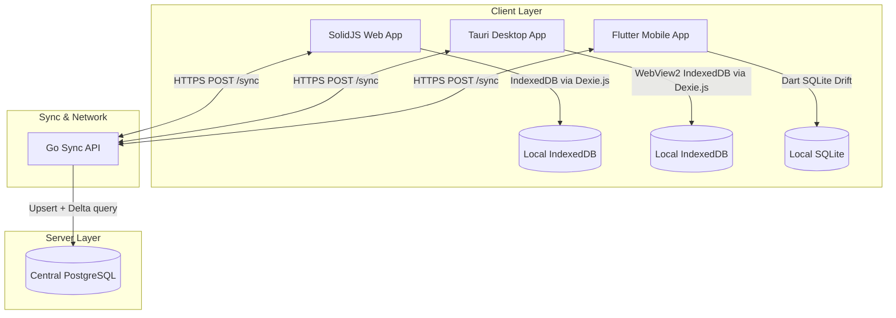
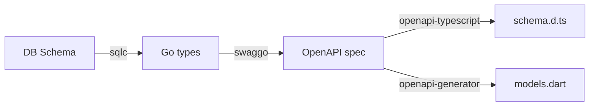
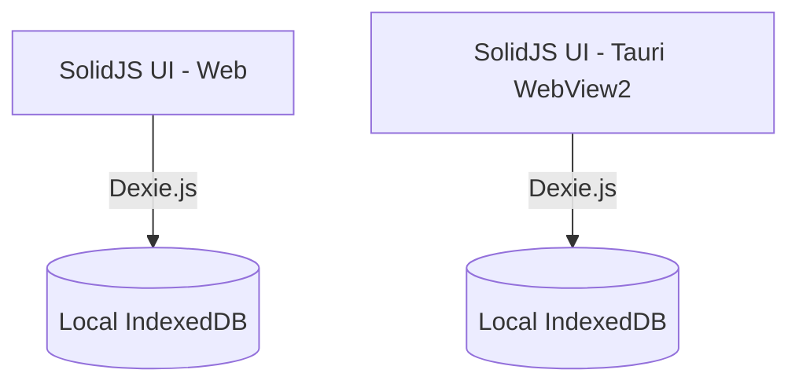
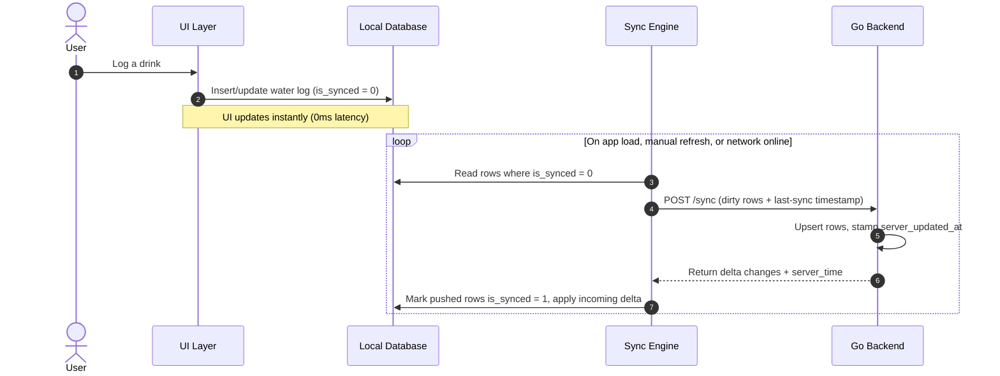
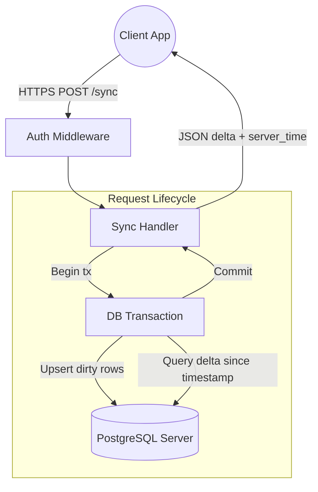
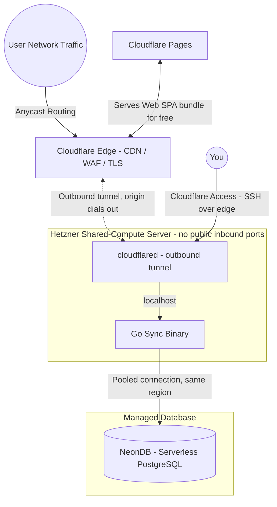

# Drinkwater: Local-First Hydration Tracker Architecture Specification

This document details the architecture for Drinkwater, a cross-platform, local-first hydration tracking application across Web, Desktop (Windows/macOS), and Mobile (Android/iOS). It is optimized for low operating cost, running a stateless Go backend on lightweight, disposable compute behind the Cloudflare edge.

---

## 1. System Topology & Data Flow

The application utilizes a **local-first paradigm**. The client-side database serves UI reads locally, guaranteeing zero-latency interactions for the user. The local store is intentionally **ephemeral**: it holds only the current day's logs, and non-today data is pruned on every sync attempt to keep client storage extremely light. On sync, the central Go backend is the **write authority**: it owns the canonical server-side record, stamps each upsert with its own `server_updated_at` timestamp, resolves conflicts so that server data is the source of truth, and serves as the durable archive of all history in PostgreSQL.



---

## 2. Repository & Schema Single Source of Truth

To manage three platforms without structural friction, the project uses a single **GitHub Monorepo**. Data structures are defined once via the database schema, exposed as an **OpenAPI** specification, and compiled into TypeScript, Dart, and Go.

### Monorepo Layout

```text
/drinkwater
├── /backend                 # Go Source Code (Sync server, API, Auth)
├── /web-desktop             # SolidJS Frontend (Shares code between Web and Desktop)
│   ├── /src                 # SolidJS UI components and state logic
│   └── /src-tauri           # Tauri shell configuration (Rust) that hosts the web build
├── /mobile                  # Flutter Application (Android/iOS)
└── /shared-schemas          # Core OpenAPI specifications for auto-generation

```

### Schema Generation Pipeline

When a data model changes, it begins in the database schema, which generates the Go types and, via swaggo, the OpenAPI specification in `/shared-schemas`. Code generation scripts then update all targets from that spec:



---

## 3. Client Storage

Web and Desktop share a single storage stack: **Dexie.js over IndexedDB**. The Tauri desktop app hosts the exact same SolidJS web build inside its WebView2 runtime, which provides IndexedDB natively, so the desktop client reuses the web data layer with no Rust storage code, no IPC hop, and no second database implementation to maintain.

The local store only ever holds the current day's logs (older rows are pruned on each sync, with PostgreSQL as the durable archive), so the dataset stays tiny and native SQLite on desktop is unnecessary.



### Database Matrix

- **Web (IndexedDB + Dexie.js):** Standard object store wrapper. Provides basic query capability within browser security sandboxes.
- **Desktop (Tauri WebView2 + IndexedDB + Dexie.js):** Runs the shared SolidJS web build; storage is the same Dexie/IndexedDB layer as Web.
- **Mobile (Flutter + Drift):** Drift provides a reactive, typesafe SQLite wrapper for Dart. It executes queries on a background isolate to keep the Flutter UI rendering smoothly.

---

## 4. Offline-First Sync & Conflict Resolution

The sync engine uses a **state-based** model with a local dirty flag to handle intermittent network availability. Each local record carries an `is_synced` flag; the engine pushes the full current state of dirty rows rather than a stream of mutation events.

### The Client Sync Cycle



### Conflict Resolution Strategy

Conflicts are resolved by **server-authoritative Last-Write-Wins**. Records are per-user and client-generated UUIDs keep rows from different devices distinct, so concurrent logging is a union rather than a conflict. When the same row is edited or deleted on more than one device, the backend's `server_updated_at` timestamp is the tiebreaker and the last write to reach the server wins.

---

## 5. Go Backend Architecture

The backend is a **stateless REST API** built on standard-library `net/http` paradigms paired with the `chi` router. Each sync is a single request/response cycle, so there are no long-lived connections, no connection hub, and no message broker to operate.



---

## 6. The Lean Deployment Strategy (Low-Cost, High-Performance)

The backend is a single stateless Go binary shipped with a minimal **Docker Compose** stack on an affordable **Hetzner shared-compute** server. Public ingress is handled by a **Cloudflare Tunnel** rather than a public reverse proxy, so the server has **no open inbound ports**. Durable state lives in a managed **NeonDB** (serverless PostgreSQL). The compute node stays lean, cheap, fully disposable, and invisible to the public internet; the history archive is run by a provider with managed backups and failover.

### Deployment Topography



### Infrastructure Components

1. **The Runtime:** A minimal **Docker Compose** file (version-controlled in the repo) runs two containers — the Go binary and **`cloudflared`**, the Cloudflare Tunnel daemon. `cloudflared` makes an **outbound** connection to the Cloudflare edge and forwards public traffic down that tunnel to the Go binary on `localhost`. TLS terminates at the edge, so there is no public reverse proxy, no Let's Encrypt certificate management, and no listening port.
2. **The Hardware:** A **Hetzner shared-compute (CX/CPX) server**, starting around 5USD/month. Because Go is extremely memory efficient and the backend is stateless, a tiny shared instance comfortably handles the low-frequency, batched sync traffic, and can be destroyed and redeployed at will since it holds no durable data.
3. **Database Persistence:** **NeonDB**, a managed serverless PostgreSQL, is the durable archive of all history (the local client store is pruned to today-only). It is chosen for affordability and safety: it **scales to zero** so we pay for database compute only while a sync is actually running, and it provides managed backups, point-in-time recovery, and failover that we would otherwise have to operate ourselves. The trade-off — network latency and cold-start wake from autosuspend — is acceptable because sync is infrequent and batched (one `POST /sync` per refresh); it is mitigated by placing the Neon project in the **same region** as the Hetzner server and using Neon's **pooled connection** endpoint to respect serverless connection limits.
4. **Web Delivery:** The SolidJS web frontend (the SPA bundle) is deployed to **Cloudflare Pages**. This is completely free, globally distributed, and serves the static files at edge speeds, meaning the Hetzner server spends zero CPU cycles serving HTML/JS and dedicates 100% of its resources to processing sync requests.

### Security Posture

The deployment is designed so that **nothing connects to the origin server directly** — every byte of inbound traffic must pass through the Cloudflare edge first.

- **Zero public attack surface.** The Hetzner firewall denies all inbound traffic; the only network path into the box is the outbound tunnel that `cloudflared` itself dials out. There are no ports to scan and no service answering on the raw IP, so the origin IP is irrelevant even if it leaks (via DNS history, TLS transparency logs, or email headers).
- **Unbypassable edge controls.** Because the tunnel is the only way in, Cloudflare's WAF, rate limiting, and DDoS absorption cannot be bypassed by hitting the origin directly — the classic "WAF bypass via leaked origin IP" attack is structurally impossible.
- **Inbound flows through the edge only.** Public clients and third-party callers (e.g. **Stripe webhooks**) reach the API by calling the Cloudflare hostname; the edge accepts the request and forwards it down the tunnel to the Go binary. Webhook endpoints still verify their own authenticity (e.g. validating the `Stripe-Signature` header) and can be restricted to the provider's published IP ranges with a WAF rule.
- **Outbound is unrestricted.** The server initiates its own outbound connections — the pooled query to NeonDB and the tunnel to Cloudflare — unaffected by the closed inbound firewall.
- **Private admin access.** SSH is not exposed publicly. Administrative access is brokered through **Cloudflare Access** over the same edge (authenticated against our identity provider), so port 22 stays closed to the internet while remaining reachable to authorized operators.
