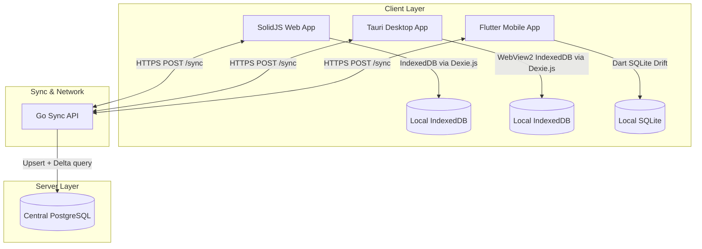
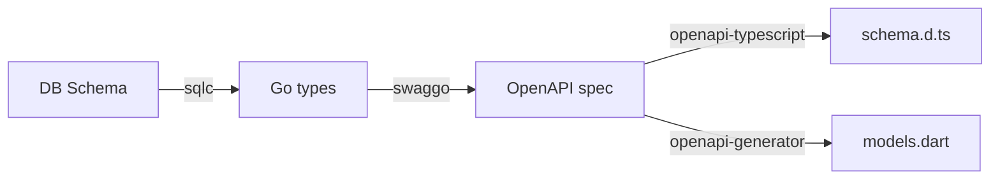
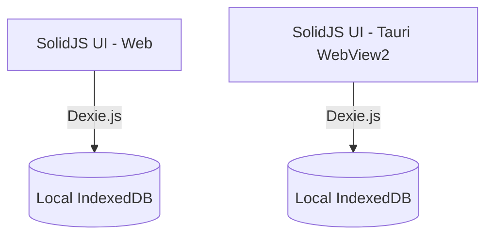
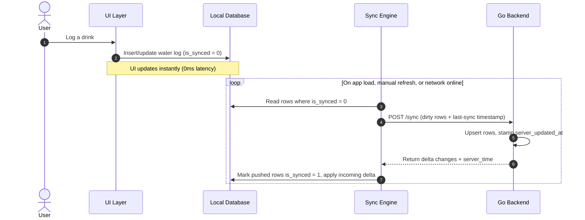
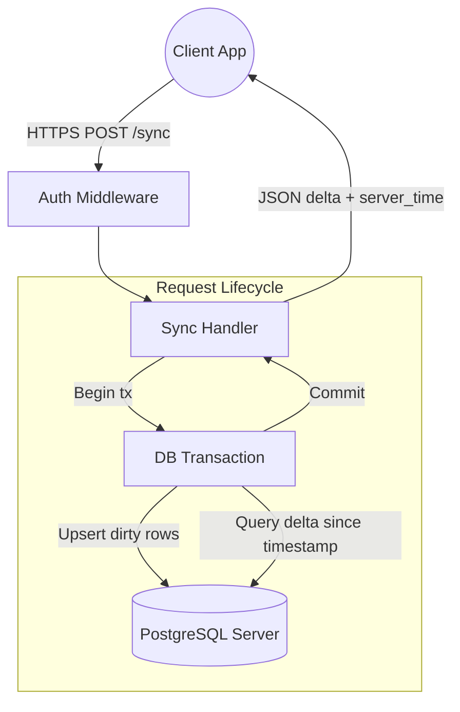
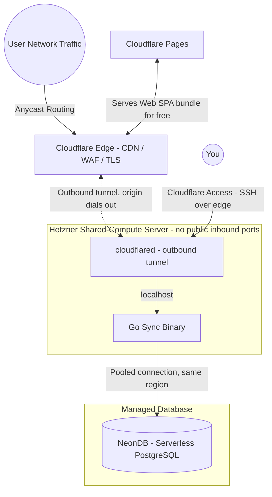
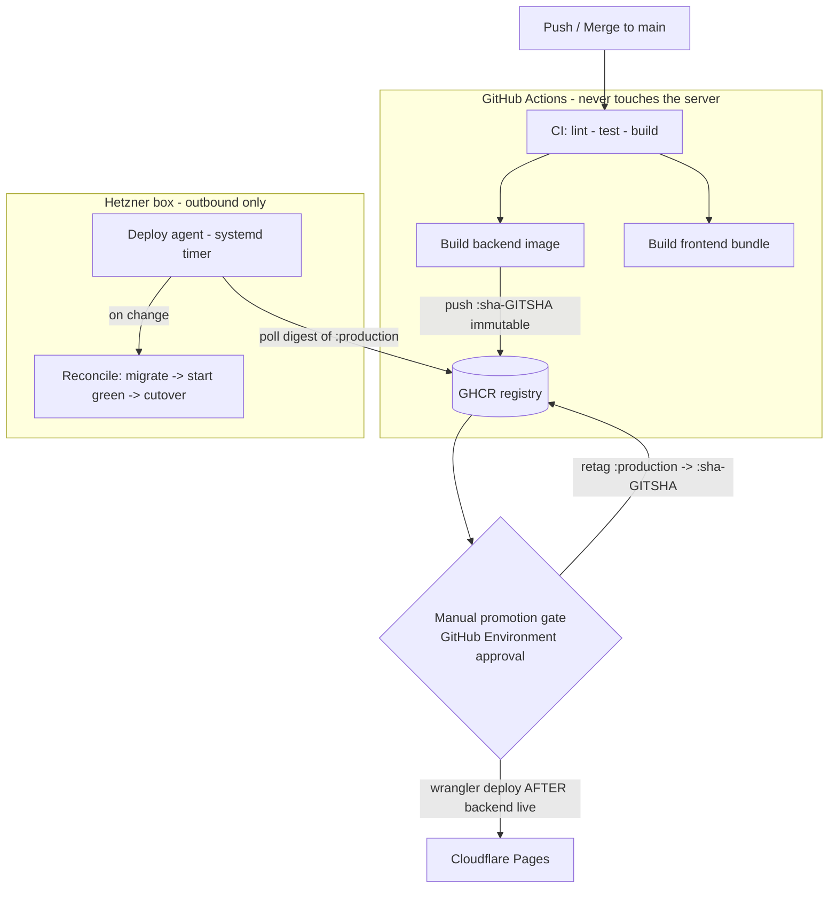
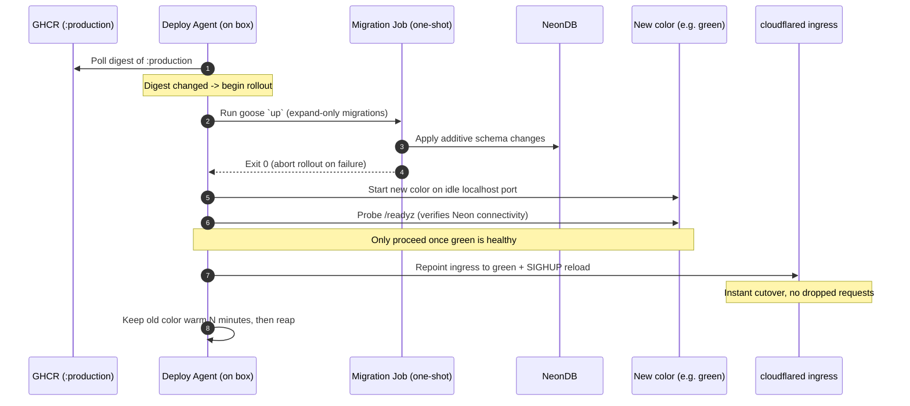
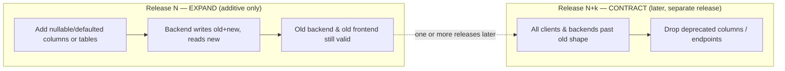
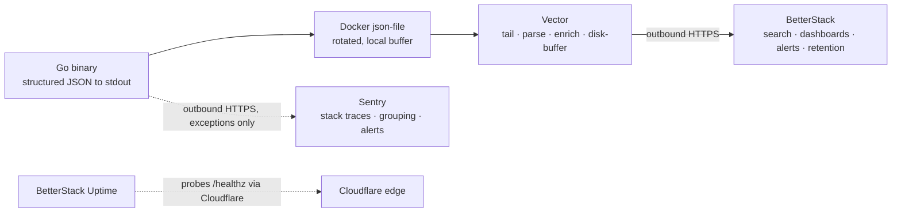

# Drinkwater: Local-First Hydration Tracker Architecture Specification

This document details the architecture for Drinkwater, a cross-platform, local-first hydration tracking application across Web, Desktop (Windows/macOS), and Mobile (Android/iOS). It is optimized for low operating cost, running a stateless Go backend on lightweight, disposable compute behind the Cloudflare edge.

---

## 1. System Topology & Data Flow

The application utilizes a **local-first paradigm**. The client-side database serves UI reads locally, guaranteeing zero-latency interactions for the user. The local store is intentionally **ephemeral**: it holds only the current day's logs, and non-today data is pruned on every sync attempt to keep client storage extremely light. On sync, the central Go backend is the **write authority**: it owns the canonical server-side record, stamps each upsert with its own `server_updated_at` timestamp, resolves conflicts so that server data is the source of truth, and serves as the durable archive of all history in PostgreSQL.



---

## 2. Repository & Schema Single Source of Truth

To manage three platforms without structural friction, the project uses a single **GitHub Monorepo**. Data structures are defined once via the database schema, exposed as an **OpenAPI** specification, and compiled into TypeScript, Dart, and Go.

### Monorepo Layout

```text
/drinkwater
├── /backend                 # Go Source Code (Sync server, API, Auth)
├── /web-desktop             # SolidJS Frontend (Shares code between Web and Desktop)
│   ├── /src                 # SolidJS UI components and state logic
│   └── /src-tauri           # Tauri shell configuration (Rust) that hosts the web build
├── /mobile                  # Flutter Application (Android/iOS)
└── /shared-schemas          # Core OpenAPI specifications for auto-generation

```

### Schema Generation Pipeline

When a data model changes, it begins in the database schema, which generates the Go types and, via swaggo, the OpenAPI specification in `/shared-schemas`. Code generation scripts then update all targets from that spec:



---

## 3. Client Storage

Web and Desktop share a single storage stack: **Dexie.js over IndexedDB**. The Tauri desktop app hosts the exact same SolidJS web build inside its WebView2 runtime, which provides IndexedDB natively, so the desktop client reuses the web data layer with no Rust storage code, no IPC hop, and no second database implementation to maintain.

The local store only ever holds the current day's logs (older rows are pruned on each sync, with PostgreSQL as the durable archive), so the dataset stays tiny and native SQLite on desktop is unnecessary.



### Database Matrix

- **Web (IndexedDB + Dexie.js):** Standard object store wrapper. Provides basic query capability within browser security sandboxes.
- **Desktop (Tauri WebView2 + IndexedDB + Dexie.js):** Runs the shared SolidJS web build; storage is the same Dexie/IndexedDB layer as Web.
- **Mobile (Flutter + Drift):** Drift provides a reactive, typesafe SQLite wrapper for Dart. It executes queries on a background isolate to keep the Flutter UI rendering smoothly.

---

## 4. Offline-First Sync & Conflict Resolution

The sync engine uses a **state-based** model with a local dirty flag to handle intermittent network availability. Each local record carries an `is_synced` flag; the engine pushes the full current state of dirty rows rather than a stream of mutation events.

### The Client Sync Cycle



### Conflict Resolution Strategy

Conflicts are resolved by **server-authoritative Last-Write-Wins**. Records are per-user and client-generated UUIDs keep rows from different devices distinct, so concurrent logging is a union rather than a conflict. When the same row is edited or deleted on more than one device, the backend's `server_updated_at` timestamp is the tiebreaker and the last write to reach the server wins.

---

## 5. Go Backend Architecture

The backend is a **stateless REST API** built on standard-library `net/http` paradigms paired with the `chi` router. Each sync is a single request/response cycle, so there are no long-lived connections, no connection hub, and no message broker to operate.



---

## 6. The Lean Deployment Strategy (Low-Cost, High-Performance)

The backend is a single stateless Go binary shipped with a minimal **Docker Compose** stack on an affordable **Hetzner shared-compute** server. Public ingress is handled by a **Cloudflare Tunnel** rather than a public reverse proxy, so the server has **no open inbound ports**. Durable state lives in a managed **NeonDB** (serverless PostgreSQL). The compute node stays lean, cheap, fully disposable, and invisible to the public internet; the history archive is run by a provider with managed backups and failover.

### Deployment Topography



### Infrastructure Components

1. **The Runtime:** A minimal **Docker Compose** stack (version-controlled in the repo) runs **`cloudflared`** (the Cloudflare Tunnel daemon) alongside the Go binary, which runs as **two interchangeable colors** (`app-blue` / `app-green`) on distinct `localhost` ports to enable zero-downtime blue-green cutover. `cloudflared` makes an **outbound** connection to the Cloudflare edge and forwards public traffic down that tunnel to whichever color is currently live on `localhost`. TLS terminates at the edge, so there is no public reverse proxy, no Let's Encrypt certificate management, and no listening port. An on-box **deploy agent** (see §7) reconciles the running color toward the latest promoted image; CI does not connect to the server.
2. **The Hardware:** A **Hetzner shared-compute (CX/CPX) server**, starting around 5USD/month. Go is memory efficient and the backend is stateless, so a small shared instance handles the low-frequency, batched sync traffic, and can be destroyed and redeployed at will since it holds no durable data.
3. **Database Persistence:** **NeonDB**, a managed serverless PostgreSQL, is the durable archive of all history (the local client store is pruned to today-only). It is chosen for affordability and safety: it **scales to zero** so we pay for database compute only while a sync is actually running, and it provides managed backups, point-in-time recovery, and failover that we would otherwise have to operate ourselves. The trade-off — network latency and cold-start wake from autosuspend — is acceptable because sync is infrequent and batched (one `POST /sync` per refresh); it is mitigated by placing the Neon project in the **same region** as the Hetzner server and using Neon's **pooled connection** endpoint to respect serverless connection limits.
4. **Web Delivery:** The SolidJS web frontend (the SPA bundle) is deployed to **Cloudflare Pages**. This is completely free, globally distributed, and serves the static files at edge speeds, meaning the Hetzner server spends zero CPU cycles serving HTML/JS and dedicates 100% of its resources to processing sync requests.

### Security Posture

The deployment is designed so that **nothing connects to the origin server directly** — every byte of inbound traffic must pass through the Cloudflare edge first.

- **Zero public attack surface.** The Hetzner firewall denies all inbound traffic; the only network path into the box is the outbound tunnel that `cloudflared` itself dials out. There are no ports to scan and no service answering on the raw IP, so the origin IP is irrelevant even if it leaks (via DNS history, TLS transparency logs, or email headers).
- **Unbypassable edge controls.** Because the tunnel is the only way in, Cloudflare's WAF, rate limiting, and DDoS absorption cannot be bypassed by hitting the origin directly — the classic "WAF bypass via leaked origin IP" attack is structurally impossible.
- **Inbound flows through the edge only.** Public clients and third-party callers (e.g. **Stripe webhooks**) reach the API by calling the Cloudflare hostname; the edge accepts the request and forwards it down the tunnel to the Go binary. Webhook endpoints still verify their own authenticity (e.g. validating the `Stripe-Signature` header) and can be restricted to the provider's published IP ranges with a WAF rule.
- **Outbound is unrestricted.** The server initiates its own outbound connections — the pooled query to NeonDB and the tunnel to Cloudflare — unaffected by the closed inbound firewall.
- **Private admin access.** SSH is not exposed publicly. Administrative access is brokered through **Cloudflare Access** over the same edge (authenticated against our identity provider), so port 22 stays closed to the internet while remaining reachable to authorized operators.

---

## 7. Continuous Delivery & Release Management

The deployment is **pull-based**. Because the Hetzner box has **no open inbound ports** (§6), CI cannot connect to it to deploy. CI builds, verifies, and publishes an immutable image; the server watches a registry channel tag and reconciles toward it. The CI runner holds no SSH keys or server credentials.

Three artifacts ship from one monorepo on independent timelines and must stay mutually compatible: the **DB schema** (NeonDB), the **backend image** (Hetzner), and the **frontend bundle** (Cloudflare Pages).

### Pipeline Overview



### Image Tagging & Promotion

CI publishes every successful build to **GitHub Container Registry (GHCR)** under an **immutable** content tag, `:sha-<gitsha>`. A **moving channel tag**, `:production`, is repointed to a vetted `:sha-<gitsha>` to promote a build. This tag mechanism provides:

- **A human gate.** Repointing `:production` runs behind a **GitHub Environment with a required reviewer**. Merging to `main` produces a candidate image; it does not ship to production until a maintainer approves the promotion.
- **Rollback.** Rolling back is repointing `:production` to the previous `:sha-<gitsha>`. This is an **image/ingress revert only — never a down migration.** Because the release's expand migration is additive (§ Release Harmony), the previous backend runs correctly against the current schema, so the schema stays forward and any data the new version wrote is preserved. Down migrations are not used in production rollback.
- **Provenance.** Every running container traces to an exact commit.

The source repository is public, so the image is published public and the box needs no registry credentials to pull. If the image is later made private, the agent authenticates to GHCR with a read-only token, which is the only delivery secret the box requires.

### The On-Box Deploy Agent & Blue-Green Cutover

A **deploy agent** — a `systemd` timer driving a shell script — runs the reconciliation loop on the server. It polls the **digest** behind `:production`; when the digest changes, it runs a blue-green rollout:



The agent is **digest-driven and direction-agnostic**: it compares the digest behind `:production` against the live color and converges toward whatever the tag points at, without distinguishing a roll-forward from a rollback. The same loop therefore serves both. On a rollback to an already-warm previous color the agent (or an operator) only flips ingress; if that color was already reaped, it re-pulls the previous `:sha` and runs the full loop.

Properties of this loop:

- **Migrations run server-side, before cutover.** The agent runs `goose up` as a **one-shot container** that exits before any new traffic is served. `goose up` is idempotent: on a roll-forward it applies the new expand migration; on a rollback the schema is already ahead, so there are no pending migrations and it is a no-op. Production DB credentials live on the box, not in CI. If the migration fails, the rollout aborts and the current color keeps serving.
- **Health-gated cutover.** The new color must pass `/readyz` (which confirms it can reach NeonDB) before the agent changes ingress.
- **Cutover is a `cloudflared` ingress reload.** The agent rewrites the tunnel ingress rule to point the hostname at the new color's port and sends `SIGHUP`; `cloudflared` hot-reloads without dropping connections.
- **Rollback window.** The previous color keeps running for a few minutes, so an immediately detected regression is an ingress flip back without an image pull.

### Release Harmony: Expand/Contract & Ordering

Versions coexist in time, which constrains what a single release may change:

1. During a blue-green cutover, the **old and new backend run against the same NeonDB**.
2. The frontend is **local-first**: the Cloudflare Pages SPA is cached and runs offline for days, so a client can be on a stale frontend while the backend has moved on.

Neither case tolerates a breaking change within one release. Schema and API changes follow the **expand/contract (parallel-change)** pattern:



- **Expand phase (this release):** schema changes are **additive** — new columns are nullable or defaulted, new tables/endpoints are introduced alongside the old. The migration ships **before** the backend that depends on it (the agent runs `goose up` before starting the new color).
- **Contract phase (a later release):** destructive changes (dropping a column, removing an endpoint) happen only after every backend and every reachable client has moved past the old shape. Expand and contract for the same field are never shipped in one release.

The per-release **deployment order** is therefore:

1. **DB migration** (additive) — agent applies it server-side before cutover.
2. **Backend** — new color goes live behind the health gate.
3. **Frontend (Cloudflare Pages)** — deployed last, via `wrangler` in the same workflow, after the backend is serving. The API removed nothing, so the previously cached frontend keeps working; the new bundle becomes available on the next client load.

The additive-only rule and this ordering keep schema, backend, and frontend compatible across their three independent timelines.

### What CI Actually Runs

The GitHub Actions workflow runs the same gates a developer runs locally before a build becomes a candidate image:

- **Backend:** `go vet` / `go build`, unit tests, a check that generated artifacts are current (`export-swagger.sh`, `db-codegen.sh` produce no diff), and that `go fmt` is clean.
- **Frontend:** `pnpm run check` (typecheck + Tailwind lint) and `pnpm run build`, plus a check that `generate-types` is in sync with the committed OpenAPI spec.
- **Migrations:** new goose migrations apply cleanly, and down-migrations exist, against an ephemeral Postgres in CI.

The image is pushed and made eligible for promotion only after all gates pass.

---

## 8. Logging & Observability

Observability is **lean**: the app is a stateless ~40MB Go process and the database lives off-box on Neon. A self-hosted log cluster (Loki/Grafana/Alloy) would be the heaviest tenant on the small Hetzner box, so the box runs only the app plus one tiny shipper and **all telemetry storage is hosted and off-box**.

### Logging Philosophy

The Go binary writes **structured JSON to stdout only** — never to files, never directly to a network sink (the sole exception is Sentry, an outbound side channel). Following 12-factor, shipping and retention are handled by the platform rather than the app. Each request produces **exactly one summary log line**, and a failure attaches its cause to that same line rather than emitting a second one.

A single logger (`go-chi/httplog`, slog-native) backs both the per-request summaries and, via `slog.SetDefault`, all startup/shutdown/DB logs, so everything shares one JSON pipeline and one set of base tags.

### Field Taxonomy

Every line carries message-plus-KV structure:

- **Base** (tagged onto all lines): `service`, `env`, `version`, `commit`, `pid`.
- **Per-request** (request-scoped): `requestID`, `method`, `path`, `remoteIP`, `user_id`, `status`, `bytes`, `duration`.
- **On error**: `error`, plus — for server faults (5xx) — `sentry_id` linking the log line to the Sentry issue that holds the stack trace. Client faults (4xx) are tagged `client_error` and are **not** sent to Sentry.

Build info (`version`/`commit`) is injected at release time via `-ldflags`, falling back to the Go toolchain's embedded VCS stamp for local builds.

### Pipeline & Topology



- **Log aggregation.** `Vector` (one ~30–60MB container) tails the app containers via the Docker `docker_logs` source, parses the JSON, enriches with `container`/`host`, and ships to **BetterStack** over outbound HTTPS with an on-disk buffer (retries instead of dropping during a BetterStack blip). The BetterStack source token lives only in Vector's env — the Go app never sees it.
- **Error tracking.** `sentry-go` captures exceptions (and panics, via middleware inside the chi `Recoverer`) with stack traces, groups them into issues, and alerts on new/spiking errors. Transport is async and errors-only (no tracing backend; `X-Request-ID` correlation is sufficient for a single stateless service). An empty `SENTRY_DSN` makes it a no-op for local dev.

### Correlation

`X-Request-ID` (chi's `RequestID` middleware generates it, or honours an inbound one) flows into the request context, every log line (`requestID`), and the Sentry scope. A request is therefore traceable end-to-end in BetterStack and pivotable to its Sentry issue via `sentry_id` — no Jaeger/OTel backend to operate.

### Health & Readiness

- `/healthz` — **liveness**: returns 200 whenever the process runs; checks no dependencies.
- `/readyz` — **readiness**: pings NeonDB with a short timeout, returns 503 if unreachable. This is the probe the §7 deploy agent gates blue-green cutover on.

Both are excluded from request logging (httplog "quiet down") so constant probing from the deploy agent and uptime monitor doesn't drown the logs. A **BetterStack uptime monitor** probes `/healthz` through the Cloudflare hostname.

### Retention

Retention lives **off-box in BetterStack** and is bounded by its plan — on the **free tier, searchable history is ~2 days**, which is sufficient for our low, batched volume (longer windows are a plan upgrade, not a box change). The box itself keeps **no durable log archive**: the Docker `json-file` driver (`max-size`/`max-file`) caps the local copy at ~30MB of rotated files (a transient tail buffer, minutes-to-hours at our volume) purely so disk can't fill — no compactor or retention service runs on the box. `docker logs | jq` remains a zero-dependency local fallback for whatever is still in that rotation.

### Alerting

- **Sentry** → exceptions, with stack-trace grouping (new issue / regression / spike).
- **BetterStack** → log-pattern and rate alerts (e.g. ERROR spikes, `/readyz` failures) plus the uptime monitor.

Both notify email/Slack.

### Graceful Shutdown

The server listens with an `http.Server` cancelled by `SIGINT`/`SIGTERM`, draining in-flight requests via `srv.Shutdown` and flushing Sentry before exit — so a blue-green cutover never drops a request or loses a buffered event.

### Security & Cost

Vector binds nothing public; it only dials **outbound** to BetterStack, consistent with the §6 closed-inbound posture. Total added footprint on the box: the Sentry SDK (in-process, negligible) plus one Vector container (~30–60MB). No stateful telemetry storage, no Grafana/Loki, no new inbound ports.
